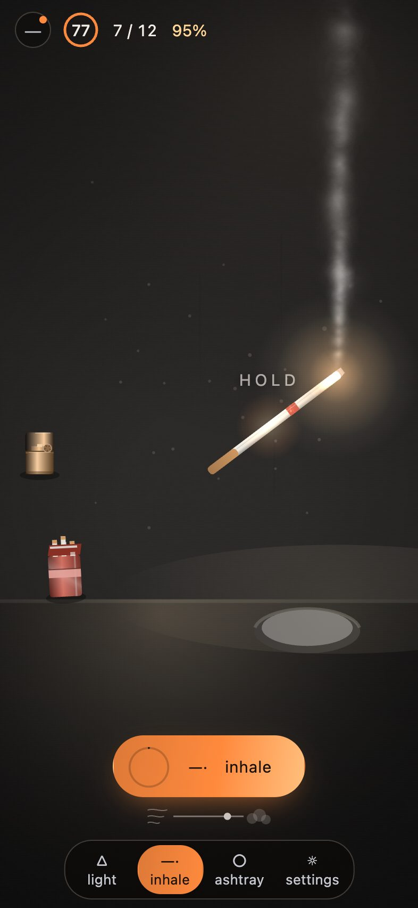
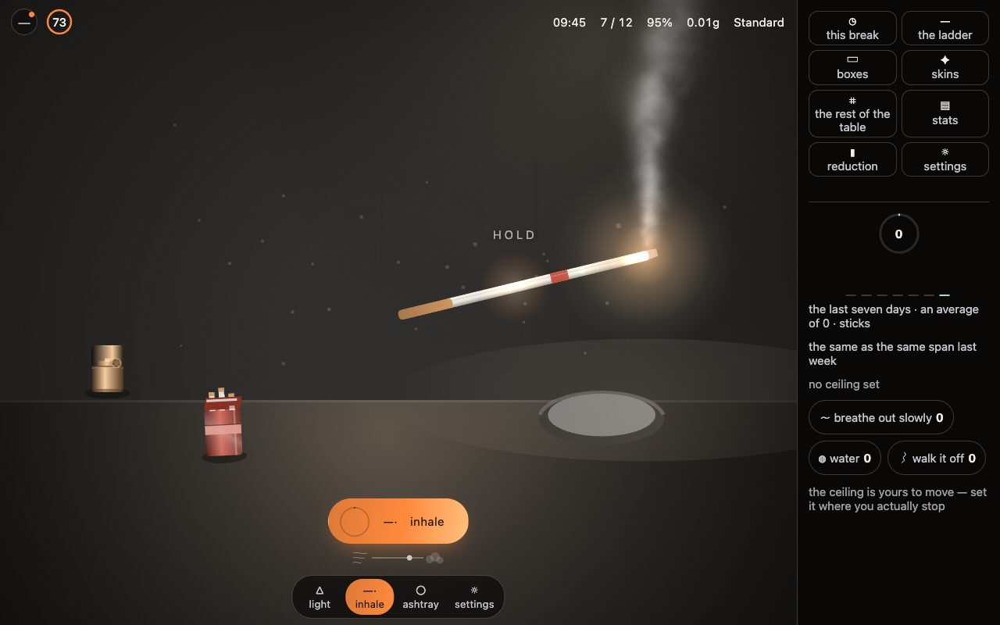
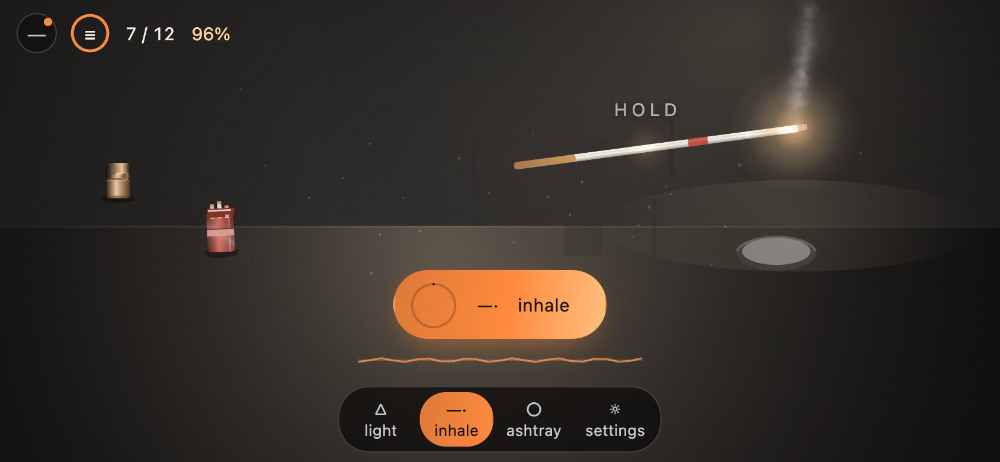
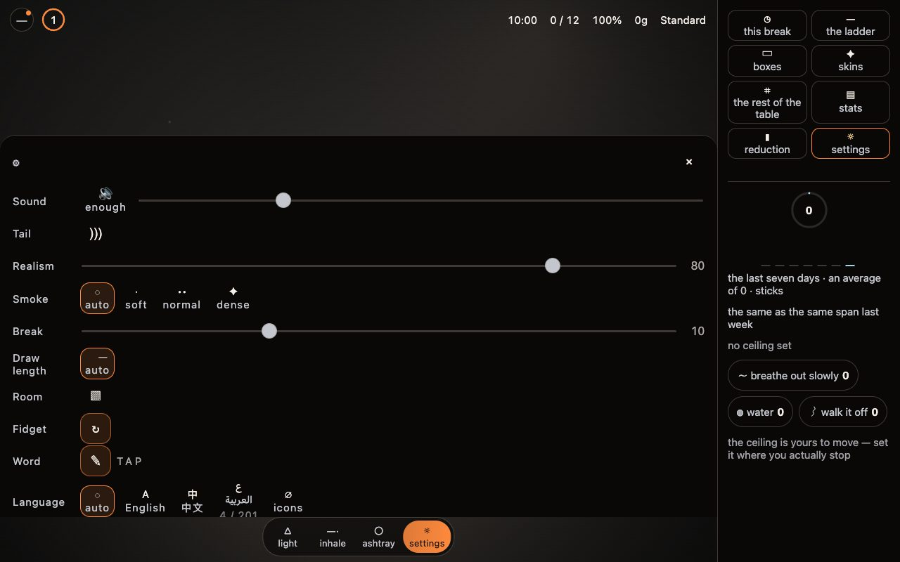

# Puffly

**Take a break. Skip the smoke.**

A wordless, offline-first smoke-break game. A table, a lighter, a tray, a rod of paper that was
never tobacco. Tap it, light it, draw, and watch the smoke take the shape that particular cigarette
makes. Nothing to read, nothing to sign up for, nothing leaves the device.

| Phone, 393×852                                                                                                                                                           | Desktop, 1280×800                                                                                                                                        |
| ------------------------------------------------------------------------------------------------------------------------------------------------------------------------ | -------------------------------------------------------------------------------------------------------------------------------------------------------- |
|                                                                                                                          |                                                                                                  |
| Mid-break: the ring is reading the strength of the breath that just left, the row counts the draws and what is left of the rod, and the plume is a line rather than fog. | The same break on a wide stage, where the props spread apart, the row stands as five figures at once, and the desk column holds the rest of the product. |
|                                                                                                                 |                                                                                                             |
| 844×390: the props spread apart instead of crowding everything into a column, and the table lifts clear of the chrome.                                                   | A word per row, and a control beside it. Nothing here is required.                                                                                       |

All four are regenerated from the built artefact by `node tests/smoke/readme-shots.mjs <url>`: it
performs a real break — picks the rod up, lights it, takes seven breaths off the pill — and
photographs what the shipped chrome prints while it does. When the interface changes, the pictures
are one command behind it rather than a stale claim about it.

**Play it now: <https://wenzo001.github.io/puffly/>** — the same build `main` publishes on every
push, installable to a phone home screen and usable offline afterwards.

The full product and engineering contract is [`docs/SPEC.md`](docs/SPEC.md); the reasoning behind
the shape of the code is [`docs/ARCHITECTURE.md`](docs/ARCHITECTURE.md). This file is the
operator's page.

## Run it

```bash
npm install
npm run dev        # http://localhost:5175
npm test           # core, renderer, audio, storage, statistics, architecture guards
npm run build      # typecheck every workspace, then build the PWA into apps/web/dist
npm run preview    # serve the production build
npm run lint       # eslint, warnings fail
npm run format     # prettier
```

Node 22.12+ (`engines` in the root `package.json`); the toolchain used here is Node 26 / npm 11.

### On a phone

`npm run dev -- --host`, then open the printed LAN address — the dev server binds localhost by
default. Once the real build is served over HTTPS it is installable from the browser menu, and it
starts offline afterwards.

Touch is a surface in its own right, not a shrunken desktop:

| Touch                                                                                                    | Keyboard                                  |
| -------------------------------------------------------------------------------------------------------- | ----------------------------------------- |
| Tap the rod, the lighter, the tray or the ash column. A finger gets a target 60 % wider than a cursor's. | `Space` hold · `Enter` tap                |
| Hold and drag the rod anywhere; let go over the tray to drop it in.                                      | `Esc` put it out                          |
| Flick the ash column with a swipe.                                                                       | Arrows move the rod in 0.05-unit steps    |
| Press the rod into the tray and hold to stub it out — the longer the press, the deader the cherry.       | `Tab` is left to the browser's focus ring |
| The canvas owns the surface: no pinch zoom, no double-tap zoom, no scroll, no text selection.            |                                           |

The stage keeps its own shape: a phone fills the screen, a desktop gets a 3:4 stage, an ultrawide
monitor gets a centred band — and Game Core is told which one it is, so hit-testing and drawing can
never disagree (`engine.setStageAspect`, called on every resize).

## What changes how it feels

Every row is a word and a control, reached from the rail’s `settings` tab. None of it is required:

- **Quality** `◌ auto · •• ✦` — `auto` is not a guess. The shell measures its own frame times and
  walks the particle budget `high → balanced → light`, stepping down twice as eagerly as it climbs
  back. A touch device also caps the canvas at 2× DPR instead of 3×.
- **Reduced motion** — fewer particles, no grain, no rain, no rings. The scene still lives.
- **High contrast** — brighter smoke and a lit edge on the rod, for a readable silhouette in a dark
  room.
- **Clock, hint words, text scale, break length, volume, ambient, mute** — and **haptics**, which
  only appears on a device that has a motor to ask, and only as a level: `navigator.vibrate` has no
  amplitude, so the slider sets how long each pulse is and how many of them arrive. **Realism** is the
  deck's own 「写实 80% / 卡通」 dial and it is a look only: it scales how hard the frame pushes in at
  the catch, how far the edges close, how much the tray rocks, how springily a spark hops and how lit
  your own breath is above the rod's idle thread — and it cannot change how long the rod burns, how
  many puffs it has, or how much ash it makes. A test runs one session at each end of the track and
  compares the entire simulation. Muting is not a
  degraded mode: when nothing can
  be heard — muted, blocked by the browser's autoplay policy, or no Web Audio at all — the discrete
  cues are drawn larger and a beat longer, so the picture says what the mix would have said.
- **Language** `◌ A 中 ع ∅` — three tiers, in this order: the language you asked for, then English,
  then no words at all. Untouched, it follows the device. `∅` is a real interface rather than a
  broken one: the sheets lose every label and keep every `aria-label`, because an unnamed control
  is the one thing this product is not allowed to ship. A language never reaches the simulation —
  the rod burns the same way whichever way you read.
- **Limit** — how many sticks a day the ring counts against, set to `—` (no line drawn) by
  default. It is a drawing decision and nothing more: no code that runs the rod may read it, and
  `tests/architecture.test.ts` fails the build if a pure package ever does.
- **Data** `⤓ ⤒ ⌫` — export the save, re-import one, or erase every record on this device.
- **Rod, room, lighter, tray** — eleven rods, twenty-one rooms, eight props (four lighters, four
  trays), five smoke styles and thirty-nine sound profiles. The
  eleven rods are the ladder of the brief: seven inhaled, three savoured, one filtered, unlocked at
  cumulative sticks, and the cabinet groups them by what the hand does with them. Each rod has a
  plume character (column, haze, curls, pour, bloom), so a Mist pours down the table while an Ember
  blooms upward. Recount them with
  `grep -c "^    id: " packages/game-content/src/{cigarettes,environments,props}.ts`. The pack lying
  beside them is a control now: an empty hand taps it to take the rod it says it holds, a hand that
  is already busy taps it to rattle the boxes inside, and neither answer spends anything. Anything
  un-tappable still may not carry an anchor or a hit radius, and a guard keeps that rule
  (`SPEC.md §37`, §49).
- **The rooms** — the twenty-one places a break can happen are a ladder of their own, not colour
  chips on the props row: a card is the room's own light, its shape, and the number of the rung that
  opens it. The rung is a level, and a level is counted in rests kept (`LEVEL_THRESHOLDS`), which is
  a thing the player did rather than a number of days that passed while the app sat shut — the seven
  places this started with were hung on the calendar, and that made an unlock a fact about
  attendance. `grep -n "LEVEL_THRESHOLDS" -A 3 packages/game-core/src/levels.ts` prints the rungs;
  `grep -n "unlock:" packages/game-content/src/environments.ts` prints which room sits on which.
  Picking one is also measured at the pixel seam rather than assumed: the same state painted with two
  rooms changes most of the colours the background asks for, and a selection that never reached the
  state would fail its own test
  (`npx vitest run packages/game-renderer/src/__tests__/scene-change.test.ts`).
- **All four layers are layers** — a skin is 纸面, 余烬, 烟羽 and 光池, and the third one used to
  reach only the haze behind the smoke, where its alpha tops out at 0.033. That was measured by
  recording every colour the renderer asks a sprite for: with a palette whose only non-default layer
  is 烟羽, 0 of 60 plume sprites changed colour. The plume now takes the skin's colour at the moment
  each puff is born, while the filter, the ash and the dust off the tray keep what the tobacco has.
  What is already in the air when you switch stays as it was for a few seconds — smoke that has left
  the rod does not get a second colour. Rerun with
  `npx vitest run packages/game-renderer/src/__tests__/plume-palette.test.ts`.
  A skin may also name one room — the deck's 「外加一个环境预设」, which the brief's own hard
  constraint seemed to forbid until it was ruled in. It is a pointer to a room that already exists
  and only moves the player into one they have already reached: 一套皮肤带来一个地方，但颜色不是钥匙.
  What a skin may never carry is a number, and that is a shape check on the shipped data rather than
  a sentence: `npx vitest run apps/web/src/__tests__/skins.test.ts` prints
  `PRESET 1 of 6 skins bring a place` and reddens on a skin that grows a fifth kind of key.
- **The smoke moves as one body.** Every particle used to sample its own noise lattice, which sounds
  like variety and is actually a swarm: neighbours were pushed in unrelated directions, so no puff
  had a body and the room read as out-of-focus fog (像雾, 没对上焦). They share the air now, and the
  difference is a shape rather than an opinion — the whole plume 2.5 seconds into a break is measured
  narrower than a tenth of the stage and taller than it is wide, and putting the per-particle lattice
  back reddens that assertion on the spot (1 red, 81 green in the package). That each puff still traces
  its own path is asserted too, because sharing a field
  is exactly what could have made them repeat. Rerun with
  `npx vitest run packages/game-renderer/src/__tests__/plume-shape.test.ts`.
- **The smoke stays in the room.** Fixing the shape did not fix the picture, so the next step was to
  rasterize a real frame — every sprite the renderer asked to blit, composited with the profile
  `sprites.ts` bakes — and look at it. It showed what no shape metric could: of the 698 sprites in one
  frame, 50 of them were on screen. The rest had left. Air drag in the pool was a single 0.9/s borrowed
  from ash, and for an aerosol that is an order of magnitude too gentle: every one of the eleven
  cigarettes had its exhaled cloud entirely outside the stage two seconds after the breath, which is
  the same defect the report described as 烟会到左上角. Smoke now has its own drag (12/s) and ash keeps
  0.9/s, and no recipe number moved — the styles are still distinguishable, from a breath that barely
  stirs to one that crosses a third of the frame. Rerun with
  `npx vitest run packages/game-renderer/src/__tests__/plume-on-stage.test.ts`.
- **The thread is one thread.** With the smoke no longer flying off, the column got audited the same
  way: walk from the cherry to the top of the thread and count how much of the way some puff's own
  disc covers, and how tall the thread stands in puffs of its own size. All eleven cigarettes pass at
  1.00 coverage and 5–24 puff-heights, and the two assertions were each proven to bite — thinning the
  emission reddens the height, shrinking the puffs reddens the coverage. The constant 12 itself is the
  fastest drag that keeps every breath on stage: at 8 two styles fail, at 6 four do. Rerun with
  `npx vitest run packages/game-renderer/src/__tests__/plume-continuity.test.ts`.
- **The button does not sit on the table.** The chrome at the bottom of the screen is fixed pixels, so
  how much of the scene it eats depends on how tall the scene is: 16% of a portrait phone's height,
  34% of the same phone turned sideways, plus a 12px pad so nothing sits flush against it. A constant
  fraction could not express that, and the picture it let through put the resting cigarette 30px
  behind the pill in landscape and left the tray 1px from it on a 320×568 screen. The clearance line
  is now computed from the stage's pixel height,
  and lifts the whole table when a window is too short for both — a desktop window keeps the table the
  brief drew. Rerun with `npx vitest run packages/game-renderer/src/__tests__/chrome-band.test.ts`.

## Architecture in one paragraph

`game-core` simulates and owns the state; it has never heard of a browser. `game-renderer` turns
state into pixels and cannot write back — the types forbid it, and a test renders a deep-frozen live
snapshot to prove it at runtime. `game-audio` does the same for sound. `apps/web` is a thin Vue
shell that exists to hand a canvas, a pointer and IndexedDB to those three, so a desktop or native
shell replaces only the shell. The rule is enforced rather than documented:
`tests/architecture.test.ts` fails if a pure package so much as names `window`, `document`,
`Math.random`, `Date.now` or an AudioContext, and it carries positive controls so the guard cannot
pass by accident.

```
apps/web/                     Vue 3 + Vite shell: canvas, chrome, sheets, PWA
packages/shared/              math, seeded RNG, colour, clock/calendar, DeepReadonly
packages/game-core/           state machine, simulation, events, sessions, replay, growth
packages/game-content/        fictional cigarettes, environments, lighters, trays, smoke, sounds
packages/game-renderer/       Canvas 2D: particles, ember, ash, environment, viewport
packages/game-audio/          Web Audio synthesis, ambient beds, silent fallback
packages/game-storage/        StorageAdapter, IndexedDB, memory fallback, export/import
packages/game-statistics/     every number on screen, derived from the session log
tests/                        architecture guards, a whole break end to end, smoke checks
docs/                         SPEC.md, ARCHITECTURE.md, images/
```

## How it plays

There is no help screen. There is one word, and only when the scene is already pointing at
something. Everything below is discoverable by pointing at it; this list exists only for people
maintaining the code.

| You do                           | You see                                                          |
| -------------------------------- | ---------------------------------------------------------------- |
| tap the cigarette                | it lifts into the hand                                           |
| tap the lighter                  | flame, then the cherry catches                                   |
| hold on the rod                  | draw: ember brightens, smoke thickens, sound rises               |
| release, while still moving      | the drawn smoke expands out _that way_                           |
| watch the ash column grow        | it bends, then asks to be flicked                                |
| tap or flick the ash             | it falls under gravity and rotation, and the tray fills up       |
| press it into the tray           | flare → burst → a low muffle → thin smoke → dark                 |
| close two fingers on the cherry  | the same thing, by a different hand                              |
| drag it over the tray and let go | its rim warms as you approach; smothered, discarded, a fresh rod |
| swipe down over nothing at all   | the interface folds away and the rod keeps burning               |
| stop touching anything           | the mark fades out, the scene keeps living (wind, light, flares) |

## How to play it

At rest there is nothing on the screen but the table. One mark appears at the bottom in the
seconds after you touch something, and it goes away when you stop. Everything else is a physical
object, and it answers to being touched the way the object would — the gesture _is_ the control.

**The four things you can touch**

| Object         | One tap                                                 | Hold                                                                    |
| -------------- | ------------------------------------------------------- | ----------------------------------------------------------------------- |
| The cigarette  | pick it up (or, if it is already out, take a fresh one) | draw — the cherry brightens and smoke gathers                           |
| The lighter    | a spark, then a flame that dies on its own              | keep the flame alive                                                    |
| The ash column | flick it: ash falls into the tray                       | —                                                                       |
| The ashtray    | put the cigarette out in it, or drop it in              | press the rod into the tray and hold: the harder and longer, the deader |

**The one word you may see**

While the chrome is awake, the object the game thinks you are about to use breathes with a faint
halo, and the halo gets a name: `tap`, `light`, `hold`, `flick`, `press`, `drop`. That is the whole
vocabulary — a verb, never a sentence, gone the moment you act, and switchable off in settings for
people who would rather be shown nothing. The word is not a button and takes no taps: the object
underneath it is what answers. Set the language to `∅` and this is the state of the game: six verbs
that only exist as a halo, and a table that says the rest.

**One break, start to finish**

1. Tap the cigarette. It lifts into the hand — a ring marks where you touched it.
2. Tap the lighter. Sparks, then flame. Bring the rod near it and the cherry catches; a cheap
   wheel lighter sometimes fails, and that is also a sound.
3. Hold on the rod and release. The drawn smoke expands when you let go. Every rod exhales
   differently: one pours down the table, one blooms upward, one curls.
4. Let the ash grow. It bends as it lengthens, and asks to be flicked.
5. Put it out: press it into the tray and hold. The cherry dies in stages — flare, burst, a low
   muffle, thin smoke, dark. It is a muffle on purpose: the sound of a press is low-passed, not a
   bright steam.
6. Drop it in the tray. **The break is over at this moment**: the clock goes away, and a fresh
   rod turns up on the table a beat later. That is not a reset — ending the break is the point of
   the loop, and the record of it (how long, how many draws, how much ash) is what accumulates.

You never have to finish a rod. Walk away mid-break and the session closes itself quietly after
about 90 seconds of stillness; nothing is scored, nothing is lost.

Putting the phone in a pocket is not walking away, and it does not end the break either. The
moment the cherry catches, the burn is tied to the system clock, so when the page comes back the
rod has burnt to wherever that clock says it should be — and a break that would have finished
while the phone was away comes back finished and counted, rather than waiting for someone to
notice it.

The room is meant to keep moving while you are not touching anything — a draught picking up, the
light changing, a swirl in the plume. What it must not do is _tremble_. Two of those numbers were
being re-rolled from scratch every frame at 60 Hz, which is a jitter with no cause behind it: the
smoke in the background leaned one way and then the other, and a still scene never looked still.
They are now sampled the same way but _approached_ rather than assigned, so the wind arrives at its
changes instead of switching on them. Measured on the same seed over thirty seconds, the largest
one-frame change in the wind went from 0.159 to 0.00064 and in the smoke's turbulence from 0.311 to
0.0033; on a real phone screen, the average per-frame pixel difference in a patch of pure background
went from 0.150 to about 0.02. Calm, not frozen — the same test also fails if the field stops
drifting altogether, because a dead world is not a restful one.

**The row, the pill and the rail**

The chrome is three things, and all three are readings of the same state machine rather than three
ways to navigate:

- **the row** across the top — which stick of the day this is, inside a ring that empties as the
  rod burns, then the break's clock and what is left of the stick: `1 · 03:00 · 100%`. The ring is
  the readout of whatever the rod is doing: it counts the flame while it is being lit (`0.4s`), the
  draws while the mouth is closed (`6 / 12`, with the hold in seconds beside it), the strength of
  the draw that just ended while the smoke is leaving (`62`, no unit — the bar under the pill is its
  legend), and the ash when a column is standing (`18mm` beside what the tray is holding in grams).
  Icons and Arabic digits: nothing in that row needs translating, which is why it survives the
  wordless tier, and every figure is a measurement the simulation already makes rather than a number
  rounded up into a claim. On a desk-width window the same row stands as five figures at once
  (clock, draws, what is left, this stick's ash, and the rod's own name where hint words are on),
  because a monitor has room for what a thumb has to take one phase at a time.
- **the pill** above the rail — the same gesture the scene accepts, as a handle. It says `pick up`,
  `light it`, `inhale`, `flick the ash`, `put it out`. Holding it draws; tapping it decides. The
  short label stays on purpose: it is the anchor a translation hangs on, so a rail of pure marks
  would leave localisation with nothing to hold. Under it the moment gets a picture rather than a
  sentence: the lungs' resistance as a waveform while the draw runs, the strength of the draw that
  just ended as a bar whose ends are three hairlines of mist and three lobes of cloud (no words at
  either end — that pair of labels is exactly what the design's own audit page struck out), and a
  tap-to-flick strip when the ash is standing. It is not always `inhale`, though: pick up a
  cigarillo, a cigar or a pipe and the handle reads `savour`, because those three are smoked from
  the mouth — the draw fills on a fixed two seconds instead of on the rod's own draw length, the
  ring follows that filling, and no resistance waveform appears, because those rods hold nothing in
  the lungs to resist. The pill learns this from the rod's measurement (`savourMs`), not from a list
  of categories the shell would have to keep true. What comes out is the other half of the same
  sentence: a mouthed draw is breathed out slowly — the cloud lives twice as long, leaves at half
  the speed and stops climbing.
- **the rail** along the bottom — three phases and settings. The phases are indicators: the
  cigarette lights one of them, and no finger is required or invited. In the wordless tier the hint
  strip that names the next gesture carries a drawing of the paper caving in instead of a word, and
  it appears only where there is no word to put it in.

On a desk-width window the same chrome gains a fourth piece: a standing 260px column on the inline-end
with the eight destinations and the day's numbers in it, and the scene shrinks to what is left rather
than being covered. It is a second density of one set of facts — the panel in that column is the very
component the break sheet renders, and each entry opens the same sheet the chrome opens, landing on
the group it names. Recount the entries with `grep -c "{ id: '" apps/web/src/rail.ts`.

The row's numbers are the stage's only numbers, and they live in the row rather than on the scene
because a measurement of the simulation is not a thing to tap. Two of its cells are buttons: the
stick mark opens the shelf, the clock opens the break. A new unlock is a dot on the stick mark —
no dialog, no text.

**What the break sheet adds: the player's own week**

Opening the break gives the counts it cannot fit on the row — how many sticks today against the
ceiling the player set, the last seven days as seven bars with today in a cooler colour, and the
difference against the same span a week ago (`较上周同期 少吸 2 支`). That is the whole of the
reduction page, and it is the reason the ceiling exists: it is never a permission. Reaching it
still lets the break start; the ring only goes grey and swaps its digit for `◇`, there is no
dialog, nothing locks, and no streak can be broken because there is no streak. The words on that
page are scanned by a test rather than by review: no line may assert anything about health, and no
line may tell the player what they should do. The ceiling itself is a preference the simulation is
not allowed to read — an architecture test fails the build if `game-core` or the renderer ever
looks at it.

**What the other sheets hold**

The cabinet is one sheet with four groups, and each group is a different question the same answer
form fits:

- **the ladder** — eleven rods, each tile four lines (its name, which of the three families it is —
  吸入型 / 品鉴型 / 过滤型, the minutes the rod itself takes, and the rung it waits on). A tile
  answers a long press with its archive card: tier two is what this stick measures, tier three
  (reached by pinning the card) is the softer reference material, and every quoted range there
  carries its `≈`.
- **the boxes** — twelve slots in three tiers, counted `0 / 12`, with the finale box reserved rather
  than locked behind a door. A collected slot opens the same card shape as a rod does, and it names
  a real brand: brands are archive material only, never an object to hold, never a price comparison
  laid out beside another brand, never a health claim (three bottom lines, each with its own guard).
- **the skins** — six, four colour layers each, and the one place a skin may name (see above).
- **the rest of the table** — the kit: lighters, trays, smoke shapes, sounds.

The `stats` entry is four numbers and nothing else, all of them derived from the session log on this
device: sticks, draws, ash in grams, and time held under the flame. The achievement row on the break
sheet reads the same four axes and nothing new is stored for it; three of its rows are the funny
gusts the room happened to roll, and the pace is a couple of months of breaks rather than a week of
tapping. Nothing anywhere awards a streak, because a streak is a punishment with better marketing.

## How it is verified

| Command                                                 | What it proves                                                                                                                                                                                                                                                                                             |
| ------------------------------------------------------- | ---------------------------------------------------------------------------------------------------------------------------------------------------------------------------------------------------------------------------------------------------------------------------------------------------------- |
| `npm test`                                              | 132 files / 1014 cases: the simulation and its state machine, replay determinism, statistics derived from the log, the boundaries above, and the two document guards — every `*.test.ts` cited here and in `docs/SPEC.md` must exist, and every `npm run …` must be a script the root package actually has |
| `npm run typecheck`                                     | Every workspace, including the Vue shell                                                                                                                                                                                                                                                                   |
| `npm run build` then `bash tests/smoke/served-build.sh` | The built app is servable from its subpath: entry script, manifest and service worker all answer                                                                                                                                                                                                           |
| `node tests/smoke/touch-device.mjs <url>`               | **96 checks** in a real browser: a whole break performed with taps on an emulated phone and with a mouse in a desktop window, the chrome read against the state it claims, and a breath with light and dark inside it                                                                                      |
| `node tests/smoke/readme-shots.mjs <url>`               | Not a check: it performs a break in the built artefact and rewrites the four pictures at the top of this file, then prints the machine values each frame was read at. What a frame should look like stays a human call                                                                                     |

The six steps above are run as one gate before a commit lands, in this order — format, lint with
`--max-warnings 0`, typecheck, `npm test`, the subpath build (`PUBLIC_BASE=/puffly/`), the served
artifact — and the device suite is run against the build that gate produced, not against the dev
server, so what is measured is what ships.

The served-build check exists because a wrong base path passes every unit test and shows up in
production as a blank page. It was verified to fail loudly, not just to pass: _index.html loads
`/puffly/assets/…`, which is not under `/wrong/`_.

The touch check drives a real browser and asserts the things a screenshot cannot lie about: the
canvas fills the viewport, a coarse pointer gets 54 px targets, double-tap does not zoom, the stage
carries no prose — at most the one gesture word — and a drawn breath is visible in the air (lit
pixels before and after). It also checks the two ways the operating system takes a phone away:
frames that stop, and a page that comes back.
It resolves Playwright and a browser binary from `PUFFLY_PLAYWRIGHT` and `PUFFLY_CHROME`, and exits
with a message rather than a false pass when either is missing.

## Shipping

`.github/workflows/deploy.yml` builds `main` and publishes it to GitHub Pages, deriving the base
path from the repository name. `.github/workflows/ci.yml` runs format, lint, types, tests, the
subpath build and the served-build check on every push and pull request.

To ship somewhere else, build with your own prefix:

```bash
PUBLIC_BASE=/any/prefix/ npm run build
```

|               |                                              |
| ------------- | -------------------------------------------- |
| Live site     | <https://wenzo001.github.io/puffly/>         |
| Workflow runs | <https://github.com/wenzo001/puffly/actions> |
| Repository    | <https://github.com/wenzo001/puffly>         |

The old `fwd001` owner path is a redirect for the repository and a 404 for Pages, so the Pages
address above is the one to share. Both were probed rather than assumed: the new address answers
200 and the old one 404.

A 404 at the live address after a push means Pages is not set to **GitHub Actions** as its
source for this repository — the deploy job cannot change that setting itself.

## Product boundaries

Puffly is an entertainment and stress-relief object: a substitute ritual. It does not claim to treat
anything and shows no medical data. Everything you can hold is original and fictional — no real
tobacco brand is ever an object in the scene, a thing to unlock, or a thing to want. Real brands
appear only as archive material (a name, an origin, a year, an ≈ figure) in the sections that are
reference rather than shopfront (SPEC.md §13, §84).

Data never leaves the device. No account, no login, no upload, no analytics; the save file is JSON
you can export and re-import (SPEC.md §51, §52).

Deleting it is a setting too: `⌫` in the data row erases every record on the device. It is the one
control in the app that cannot be undone, so it asks for the same tap twice — the button turns
amber and its word becomes `again`, and it forgets after six seconds or when you leave the sheet.
There is no confirmation dialog, and no write from the still-running simulation comes back after the
wipe: a reset that the next animation frame undoes is not a reset.

## Not built

Honest gaps, so nobody rediscovers them as bugs:

- No desktop or mobile native shell yet. The architecture is built for one (SPEC.md §79, §86); the
  app that would host it is not here.
- No accounts, sync or cloud of any kind — by design.
- Sound is synthesised from oscillators, filtered noise and envelopes. There are no samples, so a
  voice is only as close to the real object as its filter and envelope make it. The beds are at least
  measurable: `createAudioEngine` takes an injected context, so pointing it at an
  `OfflineAudioContext` renders the shipped synth and its spectrum can be compared before and after a
  change — that is how the draw's tube-to-body balance and its spectral movement were tuned (§26).
  What that cannot settle is whether it sounds _right_. Someone has now listened once and said the
  draw was too bright (偏亮), which the same ruler located: the tube sat at 1.9 kHz, putting 3.82x
  the body's energy into the 2.4 kHz band. It sits at 1.2 kHz now and that ratio measures 2.97 at
  rest, 2.48–2.73 through a pull.
- **Whether the smoke is _the_ smoke.** The shell's colours are the brief's named baseline (SPEC.md
  §57), and the plume is now measured where a player sees it: the whole body of smoke 2.5 seconds
  into a break is narrower than a tenth of the stage and taller than it is wide, every one of the
  eleven cigarettes keeps its breath inside the frame at two seconds and within 0.05 stage widths of
  the tip sideways, and the smouldering thread is continuous from the cherry to its top
  (`plume-shape`, `plume-on-stage`, `plume-continuity`). An earlier version of this bullet quoted an
  elongation of 2.4 against 1.10; that number is gone on purpose — it measured how far the cloud had
  travelled, and the cloud was travelling out of the picture. What the measurements still cannot
  answer is the only question that matters: is this the picture. The deck itself is read as text
  now: its 24 slides are extracted and every 「已改 / 问题 / 待办」 line is answered row by row in
  `docs/SPEC.md` (稿子 24 屏逐屏对账), with the numbers that screen prints — the ≤0.4 s reverb tail,
  the 80/20 split, the ash in grams per stick, the ≈ on every quoted range — pinned by tests rather
  than remembered. The frames still live in a signed-in design tool, and at the zoom that fits a
  whole page one is 27×59 CSS pixels, so the last word on the smoke is a human eye's. That division
  is deliberate: the machine proves the geometry a platform was asked for; whether it is the picture
  is not a question a threshold can answer.
- No `LICENSE` file has been chosen for the repository yet.
- The 12-box collection reserves three boxes for the cinnabar skin's finale (中华硬 / 黄鹤楼1916 /
  和天下). They are real rows that the roll skips; nothing about them is a placeholder in the data.
- The device suite **does** run on this machine: it resolves Playwright from the npm cache and a
  browser binary through `PUFFLY_CHROME` (headless Brave here — there is no Chrome.app), and the run
  that backs today's README reports `96/96 checks passed`. Two of its numbers were stale for a
  while and are not any more: the tap anchors are read from `.stage[data-aim]`, which is where the
  engine put them after the table of hand-copied unlifted coordinates was deleted, and the plume
  structure thresholds were re-measured against the picture the shared flow field and the smoke's own
  drag produce. What the suite still cannot decide is whether the picture is _right_ — the same
  division as the bullet above.
- The reading floor for text a player reads is ≥ 15px, and the desk column's eight entries are
  finger-sized at ≥ 44px; the bottom rail's caption is deliberately one notch under the floor at
  13px, because at 15px 烟灰缸 wrapped onto the mark's line — a decision with a guard of its own
  (`rail-label.test.ts`), so the two sizes cannot be mistaken for each other later.
